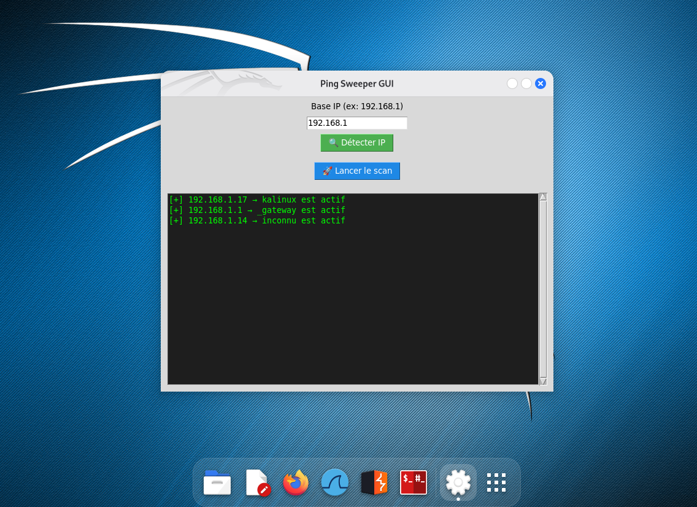

# 📡 Ping Sweeper GUI

**Ping Sweeper GUI** est une application graphique Linux développée en Python (Tkinter) qui permet de scanner automatiquement toutes les IP actives sur un réseau local.

---

## 🖥️ Fonctionnalités

- ✅ Interface graphique simple (Tkinter)
- ✅ Détection automatique de l'adresse IP locale (`192.168.X.X`)
- ✅ Scan de toute la plage `/24` (de `.1` à `.254`)
- ✅ Résolution automatique des noms d'hôtes
- ✅ Résultats affichés dans une zone scrollable
- ✅ Paquet `.deb` installable avec logo & raccourci dans le menu

---

## 📷 Capture d'écran



---

## 📦 Installation

```bash
wget https://github.com/Ghassenbrahem/pingsweeper-gui/releases/download/v1.0/scanner-gui.deb
sudo dpkg -i scanner-gui.deb
```

---

## 🚀 Lancement

Lancer depuis le menu Linux (Ping Sweeper), ou :

```bash
pingsweeper
```

---

## 🔧 Dépendances

```bash
sudo apt install python3 python3-tk
```

---

## 📁 Structure du paquet

```
scanner-gui/
├── DEBIAN/control
├── usr/
│   ├── bin/pingsweeper
│   └── share/
│       ├── applications/pingsweeper.desktop
│       └── icons/hicolor/128x128/apps/pingsweeper.png
```

---

## 👤 Auteur

Développé par **Ghassenz**  
Projet personnel d’apprentissage en cybersécurité & Linux.

🔗 GitHub : [https://github.com/Ghassenz](https://github.com/Ghassenz)

---

## ✅ Licence

Projet open-source — utilisation personnelle ou pédagogique autorisée.
